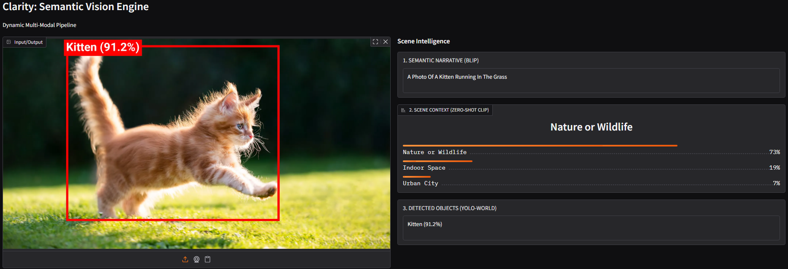

# Clarity: Semantic Vision Engine



**Clarity** is a multi-modal perception pipeline that bridges the gap between image understanding and object localization. Unlike traditional computer vision systems that rely on a fixed set of labels, Clarity uses a **Compositional AI** approach, leveraging the strengths of three state-of-the-art models to "reason" about a scene in real-time.

## Pipeline 

The system operates as a sequential chain where each model's output informs the next:

1.  **Semantic Narrative (BLIP):** Generates a natural language description of the image.
2.  **Linguistic Extraction (spaCy):** Parses the caption to identify key nouns and entities.
3.  **Open-Vocabulary Detection (YOLO-World):** Takes those nouns and dynamically re-programs its detection layer to find *exactly* what was described.
4.  **Scene Context (CLIP):** Provides a high-level environmental classification (e.g., Urban vs. Nature) to ground the visual data.

## Features

* **Dynamic Vocabulary:** No pre-defined labels. If BLIP can describe it, YOLO-World can find it.
* **Zero-Shot Learning:** Recognizes objects and scenes without any specific training on your part.
* **Fallback Logic:** If dynamic detection fails, the system automatically pivots to a robust safety net of common object classes.
* **Intelligent UI:** Built with **Gradio**, providing an interactive dashboard for image analysis and confidence telemetry.


## Stack

| Component | Model / Tool | Role |
| :--- | :--- | :--- |
| **Captioning** | `BLIP-base` | Visual-to-Text reasoning |
| **Detection** | `YOLO-World-v2-S` | Spatial localization |
| **Context** | `CLIP-ViT-B-32` | Environment classification |
| **NLP** | `spaCy (en_core_web_sm)` | Entity extraction |
| **Interface** | `Gradio` | Web dashboard & API |


## Deployment

This application is deployed on [**Hugging Face Spaces**](https://huggingface.co/spaces/viajebrandon/Clarity). 

> [!IMPORTANT]
> **Performance Note:** To keep this project accessible and free to host, it is running on the **CPU Basic** tier.
> * **Speed:** Since it lacks a GPU, processing can take longer, around **15–30 seconds** per image.
> * **Comparison:** In a GPU-accelerated environment (like Google Colab), this same pipeline runs in under **3 seconds**. 

---

## How to Run

If you want to run this locally on your own machine (assuming you have a GPU):

1. **Clone the repo:**
   ```bash
   git clone https://github.com/brandonviaje/Clarity.git
   cd Clarity
   ```

2. **Install Dependencies**
   ```bash
   pip install -r requirements.txt
   python -m spacy download en_core_web_sm
   ```

3. **Launch App**
   ```bash
   python3 app.py
   ```

It will output a localhost link where you can run the code locally.
